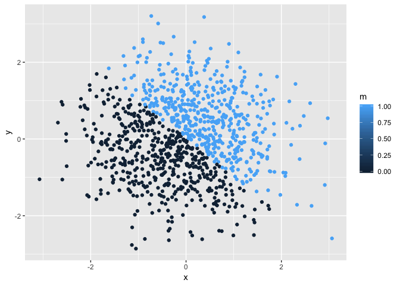

Homework1
================
Ditian Li
2018/9/20

Problem 1
=========

Create a data frame
-------------------

``` r
set.seed(666)
p1_df = tibble(
  z = runif(10, min = 0, max = 5),
  vec_logical = z > 2,
  vec_char = c("a", "b", "c", "d","e","f","g","h","i","j"),
  vec_factor = factor(c("male", "male", "female", "female","male", "male", "female", "female", "female", "female"))
)
```

Mean
----

``` r
mean(p1_df$z)
```

    ## [1] 2.502447

``` r
mean(p1_df$vec_logical)
```

    ## [1] 0.5

``` r
mean(p1_df$vec_char)
```

    ## Warning in mean.default(p1_df$vec_char): argument is not numeric or
    ## logical: returning NA

    ## [1] NA

``` r
mean(p1_df$vec_factor)
```

    ## Warning in mean.default(p1_df$vec_factor): argument is not numeric or
    ## logical: returning NA

    ## [1] NA

Mean of the random sample of size 10 from uniform distribution and vec\_logical worked, others didn't work, because they are not numeric or logical variable.

Convert
-------

``` r
as.numeric(p1_df$vec_logical)
```

    ##  [1] 1 0 1 0 0 1 1 1 0 0

``` r
as.numeric(p1_df$vec_char )
```

    ## Warning: NAs introduced by coercion

    ##  [1] NA NA NA NA NA NA NA NA NA NA

``` r
as.numeric(p1_df$vec_factor)
```

    ##  [1] 2 2 1 1 2 2 1 1 1 1

Character vector can't convert in to numeric vector, others could work.

``` r
as.numeric(as.factor(p1_df$vec_char))
```

    ##  [1]  1  2  3  4  5  6  7  8  9 10

``` r
as.numeric(as.character(p1_df$vec_factor))
```

    ## Warning: NAs introduced by coercion

    ##  [1] NA NA NA NA NA NA NA NA NA NA

Character variable from variable to factor to variable can work, and factor variable from factor to character to numeric doesn't work.

Problem 2
---------

Create data frame
-----------------

``` r
set.seed(999)

x = rnorm(1000)
y = rnorm(1000)
l = x + y > 0
m = as.numeric(l)
n = as.factor(m)

p2_df = tibble(x,y,l,m,n)
```

Description
===========

The size of the dataset 5 by 1000 table. The mean of x is -0.032516. The median of x is -0.009566. The proportion of cases for which the logical vector is TRUE: 50.9%.

Scatter plot
============

``` r
image1 = ggplot(p2_df, aes(x = x, y = y,color = l)) + geom_point()
ggsave("image1.png",plot = image1)
```

    ## Saving 7 x 5 in image

``` r
image1
```


``` r
image2 = ggplot(p2_df, aes(x = x,y = y,color = m)) + geom_point()
ggsave("image2.png",plot = image2)
```

    ## Saving 7 x 5 in image

``` r
image2
```



``` r
image3 = ggplot(p2_df, aes(x = x,y = y,color = n)) + geom_point()
ggsave("image3.png",plot = image3)
```

    ## Saving 7 x 5 in image

``` r
image3
```


